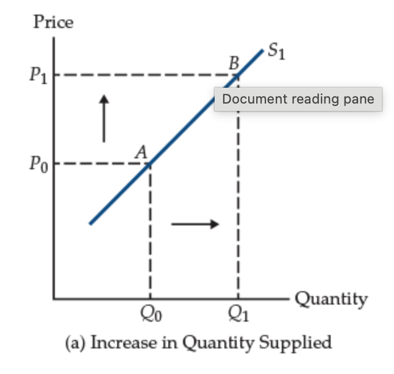

---
format:
  revealjs:
    theme: styles.scss
    transition: fade
    slide-number: true
    wide: true
    chalkboard: true
    margin: 0.1
    footer: "Introduction to Health Economics | Fall 2026 | Session 3"
    controls: true
---

::: {.title-slide}

# Economic analysis Part II: Supply analysis and market equilibrium

<br>

Wu Zeng, MD, PHD

<br>
Department of Global Health

Georgetown University

`wz192@georgegtown.edu`

<br>

[Claimer]{.themec}: I declare no confict of interest

:::

---
```{r setup, include=FALSE}

knitr::opts_chunk$set(echo = FALSE, warning = FALSE, message = FALSE, 
  comment = NA, dpi = 300, fig.align = "center", cache = FALSE)
library(tidyverse)

```

## Outline

- Supply and law of supply

  - Derivation of supply curve

- Shift in supply curve 

- Market equilibrium and price mechanism for resource allocation

- 

---

## Supply

:::: columns
::: {.column width="50%"}

- Assumption you own a firm that produces laptops, What is your goal of running a firm? 

:::
:::{.column width="50%"}

<center>


</center>

:::
::::

For a rational firm, 

- The goal is to [maximize profit]{.themec}, which is total revenue minus total cost.

$$\text{Maximize Profit} = \text{TR} - \text{TC}$$

- Supplier will continue producing goods until [marginal revenue]{.themec} equals to [marginal cost]{.themec}

<center> 

### MR = MC

</center>

---

## Law of supply 

> There is a direct relationship between the [amount of a commodity]{.themec} that a producer will make available and the [reward]{.themec} for making it available. **Positive relationship between price and quantity supplied.**

<center>



</center>

---

## How does the supply curve is derived?

Supply: quantity of a good or service that sellers are willing and able to sell at every conceivable price 

- Supply curve is derived from the [profit maximization]{.themec} behavior of firms.
  - The firm will maximize profit by choosing the quantity of output that equates [marginal revenue]{.themec} with [marginal cost]{.themec}.
  - Maximization problem: Profit = Total Revenue - Total Cost
  - Subject to: Total Revenue = Price * Quantity, Total Cost = f(Quantity of inputs)

---

## Law of supply (Supply curve)

> [The law of supply]{.themec}: a higher price will lead producers to supply a higher quantity to the market.

```{r}
#| echo: FALSE
#| fig-width: 8

supply1 <- ggplot(data.frame(x=c(0,100)),aes(x=x)) + 
  annotate("segment", x = 0, xend = 100, y = 0, yend = 800) + 
  scale_y_continuous(limits = c(0,800), breaks = seq(0, 800, by = 100)) +
  labs(x = "Quantity", y = "Price of treatment (USD)") +
  theme_classic() +
  theme(text = element_text(size=15),axis.ticks.length = unit(-2, "mm")) 

supply1+
  annotate("segment", x=0, xend = 50, y = 400, yend = 400, linetype = 2, color = "red") + 
    annotate("segment", x=50, xend = 50, y = 0, yend = 400, linetype = 2, color = "red") + 
  annotate("segment", x=0, xend = 75, y = 600, yend = 600, linetype = 2, color = "red") + 
    annotate("segment", x=75, xend = 75, y = 0, yend = 600, linetype = 2, color = "red") 
```

---

## What are the factors influencing the supply of goods or services (shift of supply curve)

- Price of goods (law of supply)

- input price (labor, rent, and so on)

- Technology

- Expectations about futures

- Number of sellers 


---

## Shift of supply curve 

### What if the wage of doctors increases

```{r}
#| echo: FALSE
#| fig-width: 8
#| fig-height: 6

supply1 + 
  annotate("segment", x = 0, xend = 60, y = 300, yend = 780, linetype = 2) +
  annotate("segment", x=0, xend = 100, y = 400, yend = 400, linetype = 2, color = "red", size = 1) +
    annotate("segment", x=12.5, xend = 12.5, y = 0, yend = 400, linetype = 2, color = "red", size = 1) +
    annotate("segment", x=50, xend = 50, y = 0, yend = 400, linetype = 2, color = "red", size = 1) + 
  annotate("text", x= 80, y = 700, label = "S", size = 4) + 
  annotate("text", x= 60, y = 700, label = "S'", size = 4) +
  annotate("segment", x=65, xend = 35, y = 550, yend = 550, linetype = 1, color = "red", arrow = arrow(),size = 1) 
```
---

## What if technology advances and make doctors and nurses more productive

```{r shiftright, echo=FALSE, fig.width = 8, fig.height = 6}
supply1 + 
  annotate("segment", x = 37.5, xend = 100, y = 0, yend = 500, linetype = 2) +
  annotate("segment", x=0, xend = 100, y = 400, yend = 400, linetype = 2, color = "red", size = 1) +
    annotate("segment", x=87.5, xend = 87.5, y = 0, yend = 400, linetype = 2, color = "red", size = 1) +
    annotate("segment", x=50, xend = 50, y = 0, yend = 400, linetype = 2, color = "red", size = 1) + 
  annotate("text", x= 80, y = 700, label = "S", size = 4) + 
  annotate("text", x= 100, y = 500, label = "S'", size = 4) +
  annotate("segment", x=75, xend = 100, y = 550, yend = 550, linetype = 1, color = "red", arrow = arrow(),size = 1) 
```

---

## What if more surgeons working in the same areas

```{r shiftright, echo=FALSE, fig.width = 8, fig.height = 6}
```

---

## Supplier surplus

### supplier surpluse: 
- Amount a seller is paid for a good minus the seller’s cost of providing it
- Price received minus willingness to sell

```{r echo=FALSE, fig.width = 8, fig.height = 6}
dta1 <- data.frame(x = c(0,0,50,0), y = c(0,400,400,0))
supply1 +
  geom_polygon( aes(x, y), data=dta1, fill = "red", alpha = 0.2) + 
  annotate("segment", x = 0, xend = 100, y = 400, yend = 400, linetype = 1, color = "red") + 
  annotate("text", x = 20, y=300, label = "Supplier \n surplus", size = 5) +
  annotate("text", x = 75, y=700, label = "S", size = 4)

```

---

## Market equilibrium

:::: columns
::: {.column width="50%"}

- Equilibrium: A situation where the price in a given market is such that the [quantity demanded]{.themec} is equal to the [quantity supplied]{.themec}.

:::
:::{.column width="50%"}

```{r equ, echo=FALSE, fig.width = 10, fig.height = 8} 
dta2 <- data.frame(x=c(0,0,50),y=c(400,600,400))
equi1 <- supply1 +
  annotate("segment", x= 0 , xend= 100 , y= 600 , yend = 200, color = "red")   + 
  annotate("text", x = 100, y= 700, label = "S", size =4) +
  annotate("text", x = 100, y= 150, label = "D", size =4)

equi1 +
  annotate("segment", x=0, xend=50, y=400, yend=400, linetype = 2, color="red") +
  annotate("segment", x=50, xend=50, y=0, yend=400, linetype = 2, color="red") +
  geom_polygon(aes(x, y), data=dta1, fill = "red", alpha = 0.2) +
  geom_polygon(aes(x, y), data=dta2, fill = "purple", alpha = 0.2)
```

:::
::::
---

## What is equilibrium price and quantity 

Demand curve function: $P_d = 600-4Q_d$

Supply curve function: $P_s = 8Q_s$

. . .

At equilibrium: $P_d = P_s$ and $Q_d = Q_s$, thus 

$600-4Q = 8Q \rightarrow 12Q = 600 \rightarrow Q = 50$; 

As $Q=50$, thus $P = 50*8 = 400$

---

## Total surplus: Walfare and efficiency perspective

::::{.block}
:::{.block-header}
Consumer surplus
:::

:::{.block-body}
- Benefit that buyers receive from a good
- Good measure of economic well-being
:::
::::

:::: columns 

:::{.column width="50%"}

### Welfare and efficiency perspective

- Demand and supply curves
  - If the value by a consumer [exceeds]{.themec} its price, consumer surplus
  - The difference between the price received and the minimum price that producers are willing to accept is a producer surplus
- Efficiency: Maximizing the total surplus received by all members of society
- Any price other than the perfectly competitive equilibrium price represents an [inefficient]{.themec} outcome

:::

:::{.column width="50%"}

<center> 


</center>
:::

::::

---

## Total surplus continue

<center> 

<iframe width="1029" height="579" src="https://www.youtube.com/embed/jBz2cAGzaDM" title="Micro: Unit 1.6 -- Consumer Surplus, Producer Surplus, and Deadweight Loss" frameborder="0" allow="accelerometer; autoplay; clipboard-write; encrypted-media; gyroscope; picture-in-picture; web-share" referrerpolicy="strict-origin-when-cross-origin" allowfullscreen></iframe>

</center>

---

## Example of inefficiency: shortage

:::: columns
::: {.column width="50%"}

```{r equ, echo=FALSE, fig.width = 5, fig.height = 5}
```

:::
::: {.column width="50%"}
```{r echo=FALSE, fig.width = 5, fig.height = 5}
dta3 <- data.frame(x=c(0,0,37.5,37.5), y1=c(0,300,300,300), y2=c(300,600,450,300))
dta4 <- data.frame(x=c(37.5, 37.5, 50), y = c(300,450, 400))

equi1+
  annotate("segment", x=0, xend=100, y=300, yend=300, linetype = 2, color="red") +
  annotate("segment", x=37.5, xend = 37.5, y=0, yend = 450, linetype = 2, color="red") +
  annotate("segment", x=75, xend = 75, y=0, yend = 300, linetype = 2, color="red") +
  geom_polygon(aes(x, y1), data=dta3, fill = "red", alpha = 0.2) +
  geom_polygon(aes(x, y2), data=dta3, fill = "purple", alpha = 0.2) +
  annotate("text", x = 50, y= 500, label = "Dead weight loss", size = 4) + 
  annotate("segment", x=50, xend=45, y=480, yend=400, linetype = 1, color="black", arrow=arrow()) 
```

:::
::::

---

## Inefficiency example 2: surplus  

:::: columns
::: {.column width="50%"}
```{r equ, echo=FALSE, fig.width = 4, fig.height = 4}
```
:::
::: {.column width="50%"}
```{r echo=FALSE, fig.width = 4, fig.height = 4}
dta5 <- data.frame(x=c(0,0,25,25),y1=c(0,500,500,200), y2= c(500,600,500,500))
  
equi1 +
  annotate("segment", x=0, xend=100, y=500, yend=500, linetype = 2, color="red") +
  annotate("segment", x=25, xend = 25, y=0, yend = 500, linetype = 2, color="red") +
  annotate("segment", x=62.5, xend = 62.5, y=0, yend = 500, linetype = 2, color="red") +
  geom_polygon(aes(x, y1), data=dta5, fill = "red", alpha = 0.2) +
  geom_polygon(aes(x, y2), data=dta5, fill = "purple", alpha = 0.2) +
  annotate("text", x = 50, y= 500, label = "Dead weight loss", size =4) + 
  annotate("segment", x=50, xend=45, y=480, yend=400, linetype = 1, color="black", arrow=arrow()) 
```
:::
::::

---

## Inefficiency example 3: Taxation

::::columns
::: {.column width="50%"}

- Fee imposed on the [consumption]{.themec} of specific items (gasoline, tobacco,
alcohol, etc.)
- Can be fixed dollar amount or a percentage of selling price
- Affects the [demand curves]{.themec}
- Used to generate [revenues]{.themec} for governments
- Create dead weight loss (inefficiency)

:::
:::{.column width="50%"}

<center>


</center>

:::
::::

---

## Equilibrium change: Market responding to shocks 

:::: columns
:::{.column width="50%"}

- income increase 

- Increase in suppliers

- Reduced rent 

:::


:::{.column width="50%"}

:::{.panel-tabset}

### Start
```{r echo=F, fig.width = 5, fig.height = 5}
equi1
```

### Income increase
```{r echo=F, fig.width = 5, fig.height = 5}
equi1 +
  annotate("segment", x=0, xend=100, y = 700, yend= 300, color = "red", linetype = 2) +
annotate("text", x=100, y = 400, label = "D'", size=4) +
  annotate("point", x=50, y= 400, size=6, color= "blue") +
  annotate("point", x=58.33, y= 466.67, size=6, color= "purple")   
```

### Suppliers
```{r sright, echo=F, fig.width = 5, fig.height = 5}
equi1 +
  annotate("segment", x=25, xend=100, y = 0, yend= 600, color = "red", linetype = 2) +
  annotate("point", x=50, y= 400, size=6, color= "blue") +
  annotate("point", x=66.67, y= 333.33, size=6, color= "purple")   +
  annotate("text", x=100, y = 600, label = "S'", size=4) 
```
### Rent
```{r sright, echo=F, fig.width = 5, fig.height = 5}
```

:::
:::
::::

---

## Market for health care

- Pareto efficiency
  - Pareto is a concept in economics that describes a situation where resources are allocated in the most efficient way possible.
  - A change in allocation is considered a Pareto improvement if it makes at least one person better off without making anyone else worse off. 
  - While Pareto efficiency is a useful benchmark, it does not address issues of [equity]{.themec} or [fairness]{.themec}. 
- Market approach to acheive [pareto efficiency]{.themec} 
  - Invisible hands
  - Describe the self-regulating nature of a free market economy.
  - Individuals pursuing their own self-Interest contribute to the overall good of society.
  - Minimal government intervention leads to market efficiency
- Government interventions

---

## Government intervention (discuss 3 minutes, why do you think government internvention is needed in health setting)

. . .

While markets can be efficient, they are not perfect and require oversight and intervention to  protect consumers, workers, and the environment and ensure fair and equitable outcomes for society.

- Market Failures include monopolies, externalities (e.g., pollution), and information asymmetries. 

- Public goods and services benefit everyone, and one person’s use does not diminish another’s. 

- Social Welfare: The state has a role in redistributing wealth and providing social safety nets to ensure a minimum standard of living for all citizens. 

---

## Key government intervention approaches

::::columns 
:::{.column width="30%"}
- Price regulation
  - Price ceiling
  - Minimum wage
- Financial incentives
  - Taxes
  - Subsidies
:::

:::{.column width="70%"}
### Taxes and subsidies

:::{.panel-tabset}

### Before subsidy

```{r echo=F}
equi1 + 
  labs(y="", x="") +
  annotate("segment", x=0, xend=50, y=400, yend=400, linetype = 2, color="red") +
  annotate("segment", x=50, xend=50, y=0, yend=400, linetype = 2, color="red") +  
  annotate("text", x=0, y=450, label = "P", size = 4) +  
  annotate("text", x=50, y=0, label = "Q", size = 4) +   
  theme(axis.text.x=element_blank(),
  axis.text.y=element_blank())
```

### After subsidy

```{r echo=F}
equi1 + 
  labs(y="", x="") +
    annotate("segment", x=25, xend=100, y = 0, yend= 600, color = "red", linetype = 2) +
  annotate("segment", x=0, xend=50, y=400, yend=400, linetype = 2, color="red") +
  annotate("segment", x=50, xend=50, y=0, yend=400, linetype = 2, color="red") +  
    annotate("segment", x=0, xend=50, y=200, yend=200, linetype = 2, color="red") +  
  annotate("segment", x=0, xend=66.67, y=333.33, yend=333.33, linetype = 2, color="blue") +
  annotate("segment", x=66.67, xend=66.67, y=0, yend=333.33, linetype = 2, color="blue") + 
  annotate("text", x=100, y=450, label = "S'", size = 4) +  
  annotate("text", x=0, y=450, label = "P", size = 4) +  
  annotate("text", x=0, y=330, label = "P'", size = 4) + 
  annotate("text", x=50, y=0, label = "Q", size = 4) +   
   annotate("text", x=66.67, y=0, label = "Q'", size = 4) +    
theme(axis.text.x=element_blank(),
      axis.text.y=element_blank())
```

:::

:::
::::

---

## Subsidy under inelastic demand 

:::{.panel-tabset}

### Before subsidy

```{r echo=F}
inelastic1 <- ggplot(data.frame(x=c(0,100)),aes(x=x)) + 
  annotate("segment", x = 0, xend = 100, y = 0, yend = 800) +
  annotate("segment", x = 25, xend = 75, y = 800, yend = 0, color = "red", linetype = 2) +  
  theme_classic() +
  labs(y="", x="") +
  annotate("segment", x=0, xend=50, y=400, yend=400, linetype = 2, color="red") +
  annotate("segment", x=50, xend=50, y=0, yend=400, linetype = 2, color="red") +  
  annotate("text", x=0, y=450, label = "P", size = 4) +  
  annotate("text", x=50, y=0, label = "Q", size = 4) +   
theme(axis.text.x=element_blank(),
      axis.text.y=element_blank())
inelastic1
```


### After subsidy

```{r echo=F}
inelastic1 + 
  labs(y="", x="") +
    annotate("segment", x=25, xend=100, y = 0, yend= 600, color = "red", linetype = 2) +
  annotate("segment", x=0, xend=50, y=400, yend=400, linetype = 2, color="red") +
  annotate("segment", x=50, xend=50, y=0, yend=400, linetype = 2, color="red") +  
    annotate("segment", x=0, xend=50, y=200, yend=200, linetype = 2, color="red") +  
  annotate("segment", x=0, xend=58.33, y=266.67, yend=266.67, linetype = 2, color="blue") +
  annotate("segment", x=58.33, xend=58.33, y=0, yend=266.67, linetype = 2, color="blue") +  
  annotate("text", x=0, y=450, label = "P", size = 4) +  
  annotate("text", x=0, y=266.67, label = "P'", size = 4) + 
  annotate("text", x=50, y=0, label = "Q", size = 4) +   
   annotate("text", x=58.33, y=0, label = "Q'", size = 4) +    
theme(axis.text.x=element_blank(),
      axis.text.y=element_blank())
```

:::

---

## What does this analysis tell us? (Discussion)

---

## The competitive model

- Free markets play a crucial role in the free enterprise system
- What is produced is determined by what people want and are able to buy
- No one individual or group dictates what must be produced or purchased; free range of choice
- Prices serve as a signal to producers, and a means of rewarding popular decisions

---

## Pricing is the main mechanism for allocating resources

- Supply and demand together determine the prices of the economy’s many different goods and services
- Prices serve as signals that guide the allocation of resources
- Prices act as a mechanism for rationing scarce resources
- Prices determine who produces each good and how much is produced

--- 

## Firm behavior under competitive [market]{.themec}

- Assumption 

. . . 

- In a perfectly competitive marketplace:
  - Many buyers and sellers
  - A standardized product
  - Mobile resources
  - Perfect information
  - Every firm must decide how much to produce and what price to charge, ultimately determined by the firm’s costs

- Each has a negligible impact on market price, and price and quantity are determined by all buyers and sellers $\rightarrow$ Consumers and producers are [price taker]{.themec} in a competitive market.

---

## How can a firm maximize profit under the competitive market?

### In what quantity should a firm produce to maximize profit?

::::columns
:::{.column width="50%"}
- Average costs and marginal cost
  - Average cost: AC
    - Total cost divided by the quantity of output
    - Average total cost = Total cost / Quantity
    - Cost of a typical unit of output
  - Marginal cost: MC
    - Increase in total cost arising from an extra unit of production
    - Marginal cost = Change in total cost / Change in quantity
    - Increase in total cost from producing an additional unit of output
:::
:::{.column width="50%"}

> It costs $1000 to produce 100 T-shirts. What is the average cost of producing a T-shirt?

$$AC = \frac{\$1000}{100} = \$10$$

> The cost of producing 101 T-shirts is $1030. What is the marginal cost of producing the 101st T-shirt?

$$MC = \frac{(\$1030 - \$1000)}{(101 - 100)} = \frac{\$30}{1} = \$30$$

:::
::::

---

## Average revenue and marginal revenue

:::: columns
:::{.column width="50%"}

- Average revenue, AR
  - Revenue per unit of output
  - AR = Total revenue / Quantity
- Marginal revenue, MR
  - Change in total revenue from an additional unit sold
  - MR = Change in total revenue / Change in quantity
- For competitive firms
  - AR = P
  - MR = P
:::
:::{.column width="50%"}

> Assume the price of the A t-shirt is $20, and the firm sells 100 T-shirts. What is the average revenue?

$$AR = \frac{(20 * 100)}{100} = \$20$$
> Assume the price of the A t-shirt is $20, and the firm sells 101 T-shirts. What is the marginal revenue to sell the 101st T-shirt?

$$MR = \frac{(20 * 101 - 20 * 100)}{(101 - 100)} = \frac{\$2020 - \$2000}{1} = \$20$$
:::
::::

---

## Maximize profit


- Produce quantity where total revenue minus total cost is greatest
- Compare marginal revenue with marginal cost
  - If MR > MC: increase production
  - If MR < MC: decrease production
  - Maximize profit where [MR = MC]{.themec}

<center>


</center>


---

## Comments and questions {.center}
